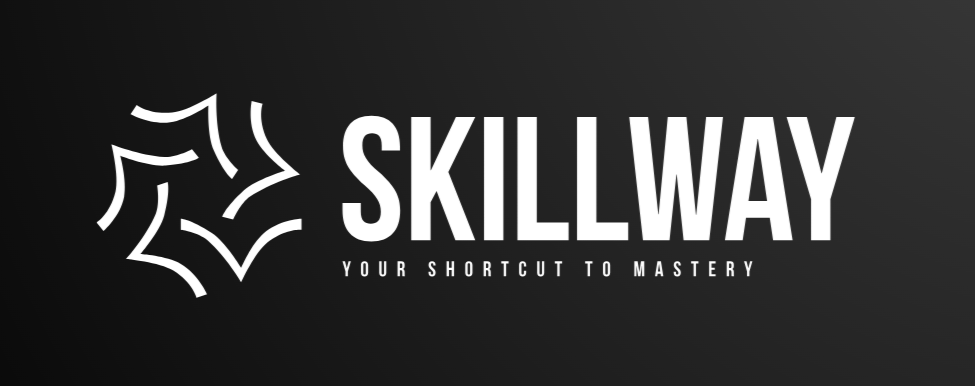

# SkillWay

<p align="center">
    <a href="https://github.com/20YoussefDhouib02/SkillWay">
        
    </a>
</p>

&nbsp;
SkillWay is an e-learning platform designed to guide learners through detailed, well-structured roadmaps to master high-demand skills such as Artificial Intelligence, DevOps, Data Science, Cybersecurity, and more. Whether you’re starting out or looking to deepen your expertise, SkillWay provides step-by-step learning paths, downloadable PDFs for offline reference along with the possiblity of tracking your progress for a personalized learning experience.

## Table of Contents
- [General Application Features](#general-application-features)
- [Technologies Used](#technologies-used)
- [Setup Instructions](#setup-instructions)
  - [Prerequisites](#prerequisites)
  - [Database Setup (MySQL)](#database-setup-mysql)
  - [Backend Setup (Spring Boot)](#backend-setup-spring-boot)
  - [Frontend Setup (Angular)](#frontend-setup-angular)
- [Usage](#usage)
- [Contributing](#contributing)
- [License](#license)
- [Support](#support)

## General Application Features
1. **User Authentication and Authorization:**
   - Secure user registration and login.
   - Role-based access control.

2. **Comprehensive Roadmaps:**
   - Detailed, structured roadmaps covering a variety of high-demand skills.
   - Downloadable PDF versions for offline learning.

3. **Personalized Learning Experience:**
   - Bookmark your favorite roadmaps.
   - Track your learning progress.
   - AI-powered roadmap generation: Search for any skill and receive a customized learning path if an existing roadmap isn’t available.

4. **Search and Discovery:**
   - Efficient search functionality.

## Technologies Used
- **Frontend:**
  - Angular
  - TypeScript and Angular CLI

- **Backend:**
  - Spring Boot for RESTful APIs
  - Apache Maven for dependency management and build automation

- **Database:**
  - MySQL

- **AI & External Services:**
  - DeepSeek API for generating customized learning roadmaps

## Setup Instructions

### Prerequisites
- **Java Development Kit (JDK):** Version 17 or higher.
- **Apache Maven:** For building and managing the backend.
- **Node.js and npm:** For Angular dependencies.
- **MySQL:** Full setup installed and running.
- **Angular CLI:** For Angular management.

(Optional) Install globally using `npm install -g @angular/cli`.

### Database Setup (MySQL)
1. Install and launch MySQL.
2. Create a new database (e.g., `SkillWay`) using MySQL CMD:
   ```sql
   CREATE DATABASE SkillWay;
   ```
3. Note your MySQL username and password for configuration.


### Backend Setup (Apache Maven)
1. Go to the official Apache Maven website `https://maven.apache.org/download.cgi`.
2. Download the latest **binary zip archive** for your operating system.
3. Extract the archive to a directory (e.g., `C:\Program Files\Apache\Maven` on Windows or `/opt/maven` on Linux/Mac).
4. Add `C:\Program Files\Apache\Maven` as a **System Variable** called `mvn` and add `C:\Program Files\Apache\Maven\bin` to the **Path** variable.


### Backend Setup (Spring Boot)
1. Open the project in your preferred IDE.
2. Navigate to the backend directory:
   ```bash
   cd backend
   ```
3. Go to the file `application.propreties` located in `src/main/resources` and change `spring.datasource.url`, `spring.datasource.username` and `spring.datasource.passowrd` with you actual database connection details.
4. Build the backend project using Maven.
   ```bash
   mvn clean install
   ```
5. Run the Spring Boot application::
   ```bash
   mvn spring-boot:run
   ```

### Frontend Setup (Angular)
1. Install Angular globally using CMD.
   ```bash
   npm install -g @angular/cli
   ```
2. Navigate to the frontend directory:
   ```bash
   cd frontend
   ```
3. Install the required npm packages.
   ```bash
   npm install
   ```
4. Start the Angular development server.
   ```bash
   ng serve
   ```
The application will be available at `http://localhost:4200`

### Additional Setup
1. Open the MySQL Command Line Client and entter your password.
2. Select the your database:
   ```sql
   USE SkillWay;
   ```
3. Enter the `3` commands located in `mysql_commands.txt` in the specified order.

## Usage
Once the application is running, you can:

- **For Learners:**  
  Browse or search for roadmaps, bookmark your favorites, download PDFs for offline reference, and track your learning progress.

- **For Roadmap Generation:**  
  If a roadmap for your desired skill is not available, simply use the search functionality to generate a customized roadmap.

---

## Contributing
Contributions are welcome! To contribute to SkillWay, please follow these steps:

1. **Fork the Repository:**  
   Create a personal fork of the project.

2. **Create a New Branch:**  
   Use a branch name that describes your feature or bug fix.

3. **Commit Your Changes:**  
   Ensure your commits are clear and descriptive.

4. **Submit a Pull Request:**  
   Once your changes are ready, submit a pull request for review.  
   
For major changes, please open an issue first to discuss what you would like to change. Please follow the project's coding standards and guidelines when contributing.

---

## License
This project is licensed under the MIT License. See the [LICENSE](LICENSE) file for more details.

---

## Support
If you encounter any issues or have questions, please feel free to reach out.

Your feedback and contributions are greatly appreciated!
